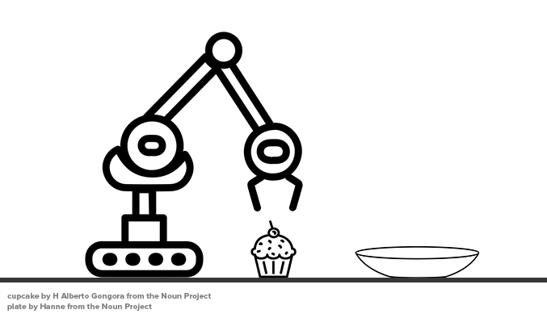

# Getting Started with PDDL

Welcome to LearnPDDL, a short guide to getting started with using PDDL.

This guide is designed for first-time readers, people who need refreshers and others, like myself, who sometimes need some syntax sanity-checking.

If you read anything here that you believe needs improvement, [contribute to it on GitHub](https://github.com/fareskalaboud/LearnPDDL). 

## Introduction

PDDL one of the few languages designed for the purpose of creating a standard for Artificial Intelligence (AI) planning. It was developed in 1998 and was introduced at ICAPS, with improvements and extensions being built into it over the years [[1]](https://en.wikipedia.org/wiki/Planning_Domain_Definition_Language#De_facto_official_versions_of_PDDL). 

The most popular of PDDL used today are PDDL2.1, which is an extension to PDDL for expressing temporal domains [[2]](http://www.jair.org/papers/paper1129.html); PDDL 3 [[3]](http://www.cs.yale.edu/homes/dvm/papers/pddl-ipc5.pdf) which adds trajectory constraints and preferences to PDDL 2.1, and PDDL+ [[4]](http://www.jair.org/papers/paper2044.html) which allows modelling mixed discrete-continuous domains in PDDL.

## Environment Setup

You can use your own text editor, the online editor at [planning.domains](http://editor.planning.domains), but I would recommend using [Visual Studio Code](https://code.visualstudio.com/#alt-downloads) with the [PDDL](https://marketplace.visualstudio.com/items?itemName=jan-dolejsi.pddl) extension built by the amazing [Jan Dolejsi](https://github.com/jan-dolejsi), which will give you syntax higlighting, hover-over information, auto-completion, plan visualization and validation and more. It also automatically downloads the VAL binaries and.

## Components of PDDL

Before we start writing PDDL, we need to understand what how to model a "world" in PDDL. 

A world is described by a set of states, each containing a list of **facts** and/or **objects**. A world begins with an **initial state**, and is governed by a set of rules and constraints that limit which **actions** can be taken in each state, and each action generally represents a transition to a different state. 

There are certain things we need to keep track of in the "world". 

- **Objects**: Things in the world that interest us.
- **Predicates**: Facts that we are interested in (e.g. properties of objects), which can be true or false.
- **An initial state**: The state of the world that we start in, i.e. things that are true at the start.
- **Goal specification**: The state of the world we want to end at, i.e. things that we want to be true at the end.
- **Actions/Operators**: Ways of changing the state of the world, i.e. things that happen that change the facts.

## PDDL Syntax

First thing you need to know, PDDL files usually have the extension `.pddl`. 

There are two PDDL files you need to learn the syntax of:

### The Domain File

The domain file establishes the context of the world. It determines what sorts of details the states can include (predicates), and what can we do to move between states in the world (actions). 

The basic syntax of a domain file is:
```
(define (domain <domain name>)
  (:predicates
    <predicate-list>
  )
  
  (:action
    <action-details>
  )
)
```

where `<domain-name>` is the name of the world.

Both **predicates** and **actions** will become clearer in examples below.

### The Problem File

The problem file represents an instance of the world we established in the domain. It determines what is true at the start of the plan (initial state), and what we want to be true at the end of the plan (goal state). 

The basic syntax of a problem file is:

```
(define (problem <title>)
	(:domain <domain-name>)
	(:objects
    	<object-list>
	)

	(:init
		<predicates>
	)
	(:goal 
		<predicates>
	)
)
```

where `<title>` is the title of the problem file and `<domain-name>` refers to the name of the corresponding domain file.

## Simple Example: Let's Eat!



Let's imagine we have a robot gripper arm, a cupcake and a plate. The gripper is empty, the cupcake is on the table and we want to put the cupcake on the plate. 

Before we model this in PDDL, let's look at the components of the PDDL problem:

First we define the domain.

```
(define (domain letseat)
```

Then we define the **objects**: plate, gripper, cupcake. We will also mark the cupcake and the arm as locatable, a little hack to help us query the locations of these objects using a predicate we'll create later.
```  
(:requirements :typing) 

(:types         
    location locatable - object
	bot cupcake - locatable
    robot - bot
)
```
We also need to define some **predicates**. Is the gripper arm empty? Where is the cupcake?

```
(:predicates
	(on ?obj - locatable ?loc - location)
	(holding ?arm - locatable ?cupcake - locatable)
    (arm-empty)
    (path ?location1 - location ?location2 - location)
)
```

We'll also have to define **actions/operators**. We need to be able to pick up and drop the cupcake, as well as move the arm between the table and the plate.
```
(:action pick-up
  :parameters
   (?arm - bot
    ?cupcake - locatable
    ?loc - location)
  :precondition
   (and 
      ; Note how we use the same variable loc
      ; in both lines below. This is to make
      ; sure it's looking at the same location.
      (on ?arm ?loc) 
      (on ?cupcake ?loc) 
      (arm-empty)
    )
  :effect
   (and 
      (not (on ?cupcake ?loc))
      (holding ?arm ?cupcake)
      (not (arm-empty))
   )
)

(:action drop
  :parameters
   (?arm - bot
    ?cupcake - locatable
    ?loc - location)
  :precondition
   (and 
      (on ?arm ?loc)
      (holding ?arm ?cupcake)
    )
  :effect
   (and 
      (on ?cupcake ?loc)
      (arm-empty)
      (not (holding ?arm ?cupcake))
   )
)

(:action move
  :parameters
   (?arm - bot
    ?from - location
    ?to - location)
  :precondition
   (and 
    (on ?arm ?from) 
    (path ?from ?to)
   )
  :effect
   (and 
    (not (on ?arm ?from))
    (on ?arm ?to)
   )
)
```
 
Put all the above into a file, and you have [a domain file](https://github.com/fareskalaboud/LearnPDDL/blob/master/files/letseat/domain.pddl)!

Now we'll look at the problem file. We'll start by letting it know which domain it's associated to, and define the objects that exist in the world.
```
(define (problem letseat-simple)
	(:domain letseat)
	(:objects
    	arm - robot
    	cupcake - cupcake
    	table - location
    	plate - location
	)
```
Then, we'll define the **initial state**: the gripper is empty, the cupcake is on the table, and the arm can move between both.
```
(:init
	(on arm table)
	(on cupcake table)
	(arm-empty)
	(path table plate)
)
```
Finally, we define the **goal specification**: the cupcake on in the plate.
```
(:goal 
	(on cupcake plate)
)
```
Put that all together and you'll have [the problem file](https://github.com/fareskalaboud/LearnPDDL/blob/master/files/letseat/pfile.pddl)!

If you run this using [OPTIC](https://nms.kcl.ac.uk/planning/software/optic.html), you'll get this solution:

```
Initial heuristic = 3
Initial stats: t=0s, 4299060kb
b (2 @ n=3, t=0s, 4300084kb)b (1 @ n=6, t=0s, 4308276kb)
;;;; Solution Found
; Time 0.00
; Peak memory 4308276kb
; Nodes Generated: 5
; Nodes Expanded:  3
; Nodes Evaluated: 6
; Nodes Tunneled:  1
; Nodes memoised with open actions: 0
; Nodes memoised without open actions: 6
; Nodes pruned by memoisation: 0
0: (pick-up arm cupcake table) [1]
1: (move arm table plate) [1]
2: (drop arm cupcake plate) [1]
```

#### Exercises:
Here are a few tasks to make it more complex and enforce your understanding.
- Add a second cupcake on the table, and add it to the goal spec to make sure it's put on the plate as well.
- Add a unicorn object to the domain, and make the goal for the unicorn to eat the cupcake. The unicorn can only eat the cupcake if it's on the plate.

## Not-as-Simple Example

If you want to check out something a bit more complex, check out the [driverlog domain](https://github.com/fareskalaboud/LearnPDDL/tree/master/files/driverlog).

## Past the Basics

If you're a first timer, don't venture into this part until after you've fully understood the basics. 

### Durative Actions

You can actually give actions durations to work in temporal domains.

Each condition and effect is given the time at which it's supposed to happen.

There are a few types of temporal constraints:

`(at start (<condition/effect>))`, which means this must be true or happen at the start of the action.
`(at end (<condition/effect>))` , which means this must be true or happen at the end of the action.
`(over all (<condition>))`, which means this must be true for the full duration of the action.

Below is an example of the `(move)` action from our previous example transformed into a durative action. 
```
(:durative-action move
  :duration (= ?duration 10) ; Duration goes here.
  :parameters
   (?arm - bot
    ?from - location
    ?to - location)
  :condition ; Note how this is "condition" not "pre-condition"
   (and 
    (at start (on ?arm ?from))
    (over all (path ?from ?to))
   )
  :effect
   (and 
    (at start (not (on ?arm ?from)))
    (at end (on ?arm ?to))
   )
)
```

### Functions

Functions in PDDL are used to represent numeric values that can change over time as actions are executed. These functions are useful for more complex planning problems where simple predicates (true/false) are not enough. Functions allow planners to handle quantities like resources, distances, or costs. They're perfect for calculating variables like temperature, speed, energy, etc. 

Functions in PDDL are defined using the :functions keyword within the domain file. They can be used within action definitions to update values dynamically.

In the below example, the `distance` function defines the distance between two locations, and the `fuel` function keeps track of the fuel level in a vehicle. The `drive` action decreases the fuel level based on the distance traveled.

```
(define (domain logistics)
  (:requirements :typing :fluents)

  (:types
    package location vehicle - object)

  (:predicates
    (at ?pkg - package ?loc - location)
    (in ?pkg - package ?veh - vehicle)
    (at ?veh - vehicle ?loc - location))

  (:functions
    (distance ?loc1 - location ?loc2 - location)
    (fuel ?veh - vehicle))

  (:action drive
    :parameters (?veh - vehicle ?loc1 - location ?loc2 - location)
    :precondition (and (at ?veh ?loc1) (> (fuel ?veh) (distance ?loc1 ?loc2)))
    :effect (and (not (at ?veh ?loc1)) (at ?veh ?loc2) (decrease (fuel ?veh) (distance ?loc1 ?loc2))))

  (:action load
    :parameters (?pkg - package ?loc - location ?veh - vehicle)
    :precondition (and (at ?pkg ?loc) (at ?veh ?loc))
    :effect (and (not (at ?pkg ?loc)) (in ?pkg ?veh)))

  (:action unload
    :parameters (?pkg - package ?loc - location ?veh - vehicle)
    :precondition (and (in ?pkg ?veh) (at ?veh ?loc))
    :effect (and (at ?pkg ?loc) (not (in ?pkg ?veh))))
)
```

### Processes & Events

PDDL+ introduces processes and events, which are crucial for modeling continuous change and exogenous events in dynamic systems. These elements allow for more realistic and flexible planning in environments where the state can change independently of the actions taken by the planner.

#### Processes

Processes represent continuous activities that change the state over time as long as certain conditions remain true. They are defined using the `:process` keyword. A process has conditions that need to be true for it to be active and effects that continuously change the state. If these conditions are true, the process is **always running**.

In the below snippet, the `fuel-consumption` process continuously decreases the fuel level of a vehicle as long as it is moving, with the rate of consumption dependent on the vehicle's speed and the duration of movement.

```
(:process fuel-consumption
  :parameters (?veh - vehicle)
  :condition (at start (moving ?veh))
  :effect (decrease (fuel ?veh) (* (speed ?veh) ?duration)))
```

Of course, you can set numeric constants in the effect of a process, not only variables.

#### Events

Events represent instantaneous occurrences that can change the state of the world. They are defined using the `:event` keyword. An event has a condition that triggers it and effects that change the state. Once the condition is true, it immediately activates.
```
(:event low-fuel
  :parameters (?veh - vehicle)
  :precondition (<= (fuel ?veh) 10)
  :effect (not (moving ?veh)))
```

Processes and events add a layer of complexity and realism to PDDL models, allowing planners to handle continuous and unpredictable changes in the environment. 

#### What's the difference between processes and events?

Think of processes and events in PDDL as the AI planning world's equivalent of while loops and if statements in coding. 

Imagine processes as the diligent while loops, tirelessly working in the background, constantly checking if certain conditions are met and then continuously performing their magic as long as those conditions hold true. They're like a robot that keeps vacuuming the floor as long as it detects dirt. 

On the other hand, events are the snappy if statements, springing into action only when a specific condition is met, just once, and then they move on. They're like a toaster that pops up when your bread is perfectly toasted.

Processes are the steady workers maintaining ongoing tasks, events are the quick responders, handling sudden changes with swift precision.

# But wait, there's more?

Of course there is. This is a very small guide, but can be improved greatly with your contribution. Feel free to submit a [pull request](https://github.com/fareskalaboud/LearnPDDL/pulls).

# Contributions

- **[Fares Alaboud](http://faresalaboud.me)** (Author)
- **[Dr. Andrew Coles](http://nms.kcl.ac.uk/andrew.coles)** (Editor)
- **[Jan Dolejsi](https://github.com/jan-dolejsi)** (Contributor)
- **[Daniel Kröni](https://github.com/danielkroeni)** (Contributor)

# References

[1] [PDDL's Wikipedia Page](https://en.wikipedia.org/wiki/Planning_Domain_Definition_Language#De_facto_official_versions_of_PDDL)

[2] Fox, M. and Long, D. (2003). PDDL2.1: An Extension to PDDL for Expressing Temporal Planning Domains. [online] Available at: [http://www.jair.org/papers/paper1129.html](http://www.jair.org/papers/paper1129.html) [Accessed 20 Nov. 2017]. 

[3] Gerevini, A. and Long, D. (2005) Plan Constraints and Preferences in PDDL3. Volume 27, pages 235-297. [online] Available at [http://www.cs.yale.edu/homes/dvm/papers/pddl-ipc5.pdf](http://www.cs.yale.edu/homes/dvm/papers/pddl-ipc5.pdf)


[4] Fox, M. and Long, D. (2006) Modelling Mixed Discrete-Continuous Domains for Planning. Volume 27, pages 235-297. [online] Available at [http://www.jair.org/papers/paper2044.html](http://www.jair.org/papers/paper2044.html)
