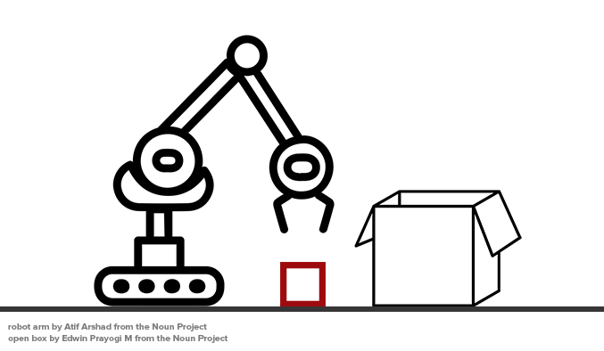

# Getting Started with PDDL

 **NOTICE**: This is a work in progress and is being updated weekly.

Welcome to LearnPDDL, a short guide to getting started with using PDDL.

This guide is designed for first-time readers, people who need refreshers and others, like myself, who sometimes need some syntax sanity-checking.

If you read anything here that you believe needs improvement, [contribute to it on GitHub](https://github.com/fareskalaboud/LearnPDDL). 

## Introduction

PDDL one of the few languages designed for the purpose of creating a standard for Artificial Intelligence (AI) planning. It was developed in 1998 and was introduced at ICAPS, with improvements and extensions being built into it over the years [[1]](https://en.wikipedia.org/wiki/Planning_Domain_Definition_Language#De_facto_official_versions_of_PDDL). 

The most popular of PDDL used today are PDDL2.1, which is an extension to PDDL for expressing temporal domains [[2]](http://www.jair.org/papers/paper1129.html); PDDL 3 [[3]](http://www.cs.yale.edu/homes/dvm/papers/pddl-ipc5.pdf) which adds trajectory constraints and preferences to PDDL 2.1, and PDDL+ [[4]](http://www.jair.org/papers/paper2044.html) which allows modelling mixed discrete-continuous domains in PDDL.

## Environment Setup

You can use your own text editor, but I would recommend using [Sublime Text](https://www.sublimetext.com/) with [Package Control](http://packagecontrol.io). This way you can make use of the [myPDDL package](https://github.com/Pold87/myPDDL), which will give you syntax higlighting. 

## Components of PDDL

Before we start writing PDDL, we need to understand what how to model a "world" in PDDL. 

A world is described by a set of states, each containing a list of **facts** and/or **objects**. A world begins with an **initial state**, and is governed by a set of rules and constraints that limit which **actions** can be taken in each state, and each action generally represents a transition to a different state. 

There are certain things we need to keep track of in the "world". 

- **Objects**: Things in the world that interest us.
- **Predicates**: Facts that we are interested in (e.g. properties of objects), which can be true or false.
- **An initial state**: The state of the world that we start in, i.e. things that are true at the start.
- **Goal specification**: The state of the world we want to end at, i.e. things that we want to be true at the end.
- **Actions/Operators**: Ways of changing the state of the world, i.e. things that happen that change the facts.

## PDDL Syntax

First thing you need to know, PDDL files usually have the extension `.pddl`. 

There are two PDDL files you need to learn the syntax of:

### The Domain File

The domain file establishes the context of the world. It determines what sorts of details the states can include (predicates), and what can we do to move between states in the world (actions). 

The basic syntax of a domain file is:
```
(define (domain <domain name>)
  (:predicates
    <predicate-list>
  )
  
  (:action
    <action-details>
  )
)
```

where `<domain-name>` is the name of the world.

#### Predicates

If you remember, I mentioned earlier that predicates are facts that we are interested in (e.g. properties of objects), which can be true or false. They can also be properties of objects. 

#### Actions

Actions, in their simplest form, represent transitions between states in the world. They usually have conditions which must be true in order for them to take place, and effects which change facts in the world.

Both **predicates** and **actions** will become clearer in examples below.

## Super-Simple Example



Let's imagine we have a 

## Simple Example

## Not-so-Simple Example

## Past the Basics

If you're a first timer, don't venture into this part until after you've fully understood the basics. 

### Domains: Durative Actions

TBC

### Domains: Functions

TBC

### Domains: Processes & Events

TBC

### The Problem File


# Contributions

- **[Fares Alaboud](http://faresalaboud.me)** (Author)
- **[Dr. Andrew Coles](http://nms.kcl.ac.uk/andrew.coles)** (Editor)

If you'd like to be listed as  a Contributor, make a [pull request](https://github.com/fareskalaboud/LearnPDDL/pulls).

# References

[1] [PDDL's Wikipedia Page](https://en.wikipedia.org/wiki/Planning_Domain_Definition_Language#De_facto_official_versions_of_PDDL)

[2] Fox, M. and Long, D. (2003). PDDL2.1: An Extension to PDDL for Expressing Temporal Planning Domains. [online] Available at: [http://www.jair.org/papers/paper1129.html](http://www.jair.org/papers/paper1129.html) [Accessed 20 Nov. 2017]. 

[3] Gerevini, A. and Long, D. (2005) Plan Constraints and Preferences in PDDL3. Volume 27, pages 235-297. [online] Available at [http://www.cs.yale.edu/homes/dvm/papers/pddl-ipc5.pdf](http://www.cs.yale.edu/homes/dvm/papers/pddl-ipc5.pdf)


[4] Fox, M. and Long, D. (2006) Modelling Mixed Discrete-Continuous Domains for Planning. Volume 27, pages 235-297. [online] Available at [http://www.jair.org/papers/paper2044.html](http://www.jair.org/papers/paper2044.html)
